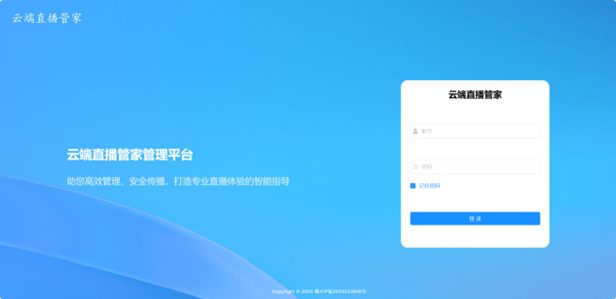
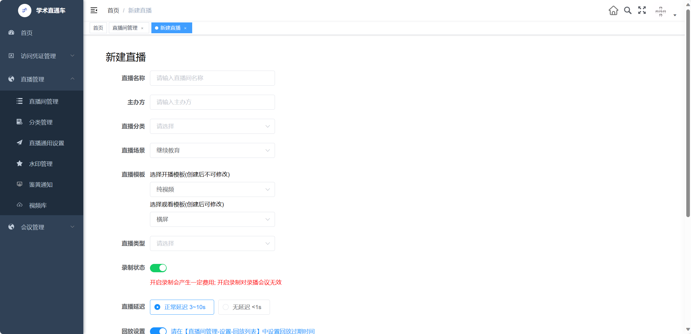
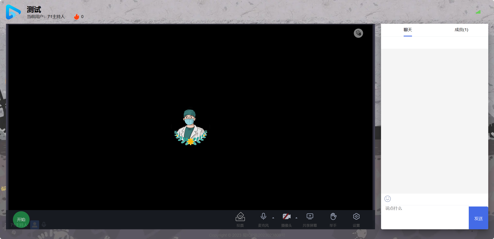
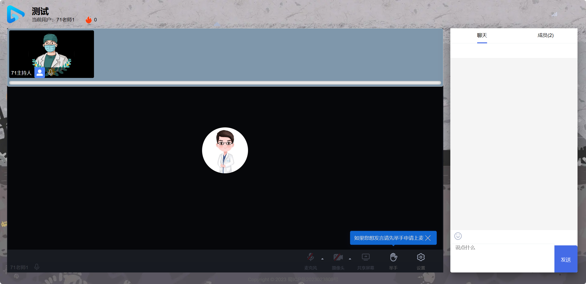
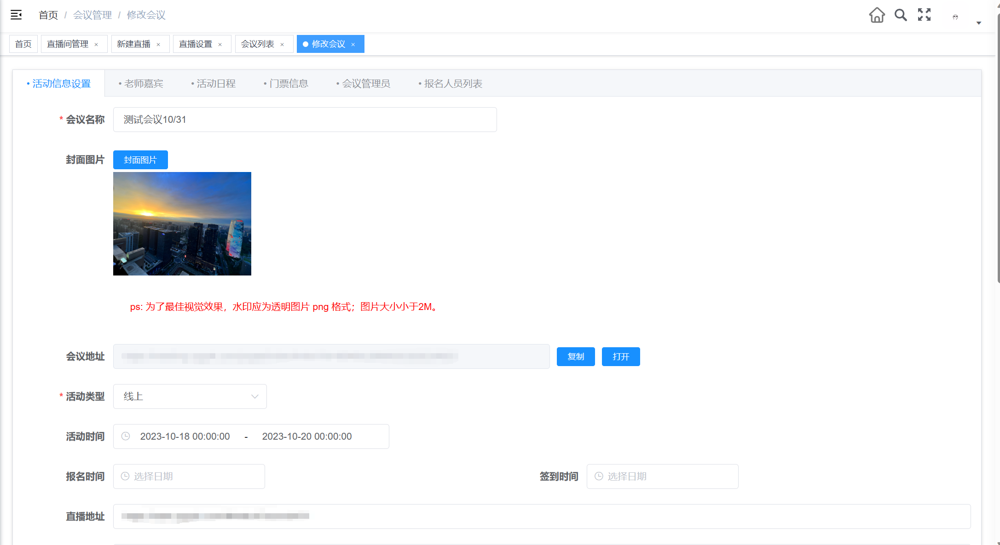
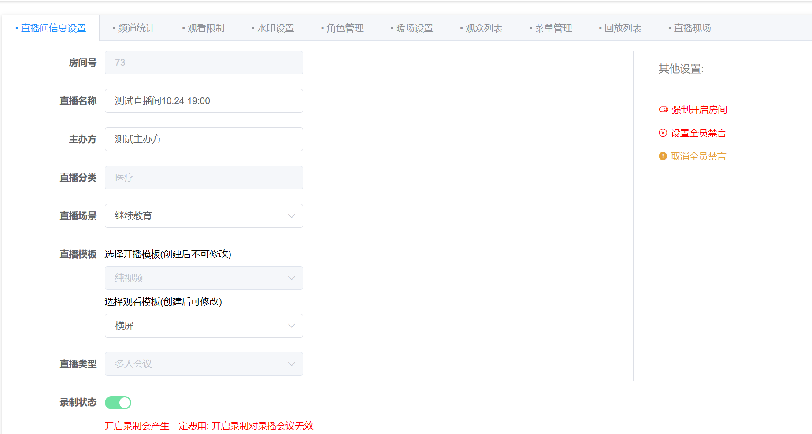
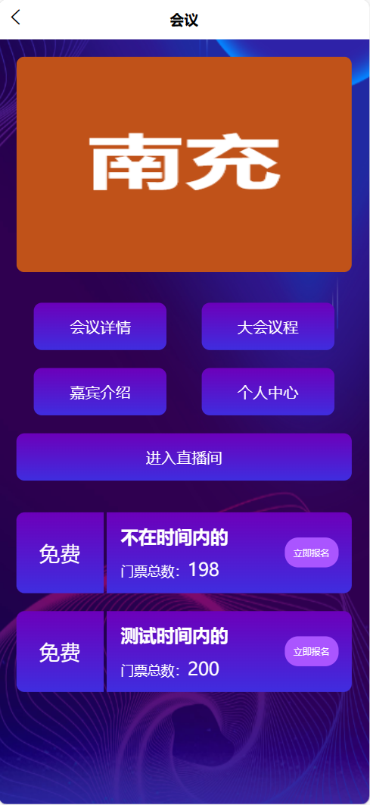

# 直播会议一体化

#### 介绍
直播会议一体化平台是一个综合性解决方案，集成了在线直播和会议管理功能。该平台提供高清视频传输、多人同时直播、观众互动、会议预约、邀请与登记、文档与屏幕分享等功能。同时，它具备数据加密、权限控制等安全性特点，支持多种终端设备，为用户提供了便捷、高效、安全的在线会议体验。

#### 获取方式

获取完源码方式加QQ：627264788

#### 使用说明
 **直播系统** 

登录页

直播管理创建页面

观众端，做了手机适配页面

主持人端

嘉宾端

 **会议系统** 

会议的创建页面

会议的管理页面

会议的报名端

